[GatsbyJS](http://gatsbyjs.org/) is everywhere these days. The upstart react-based site generator has come a long way from its humble beginnings. A couple of years ago, Gatsby definitely played second (or third, or fourth?) fiddle to more prominent static site generators like Jekyll and Hugo. Fast forward a couple years, however, and the web development world is raving about Gatsby. And for good reason! The React front-end ecosystem continues to boom, with no indication that it will slow any time soon. Meanwhile, Gatsby has outgrown its origins as a static site generator. Growing in parallel with the prevalence of the [JAMStack](https://jamstack.org/) and the maturation of microservices/serverless architectures, Gatsby has repositioned itself as a unifying technology at the center of what [the creators of Gatsby call "the content mesh"](https://www.gatsbyjs.org/blog/2018-10-04-journey-to-the-content-mesh) – a confluence of services, content, and functions that make up a complex web application.

Despite being oriented toward microservices architectures, some of the most popular back-end content providers for Gatsby sites have been traditional, monolithic CMS like Drupal or Wordpress. While decoupling (especially with ReactJS) has been popular for a few years now, the daunting task of recreating all the standard CMS functionalities (routing, credentialed access, search) has kept a lot of people deterred from the approach. Additionally, creating a decoupled website from scratch means you have two completely separate applications that have to be consistently available, each of which has their own maintenance requirements, hosting costs, etc. Gatsby, on the other hand, provides a good compromise between the out-of-the-box completeness of a monolithic CMS like Drupal and the developer experience and flexibility of a decoupled site.

A few weeks ago I began the process of converting my personal website and blog to run on a GatsbyJS front end with my existing Drupal 8 site on the back-end. As a result, I learned a lot about how Gatsby works, and various tricks for importing and manipulating Drupal data in your Gatsby application. But now I'm taking what I've learned and making it available as a brief tutorial for people who already have an intimate familiarity with Drupal to experiment with what Gatsby can offer your site from a front-end perspective.

**Note:** if you get lost following along, I've [put together a Github repo](https://github.com/porkloin/drupal-8-gatsby) that has a branch for each of the following number steps along the way. Use the "branch" drop down to select which step you're on and compare your work!

### 1\. Install Gatsby

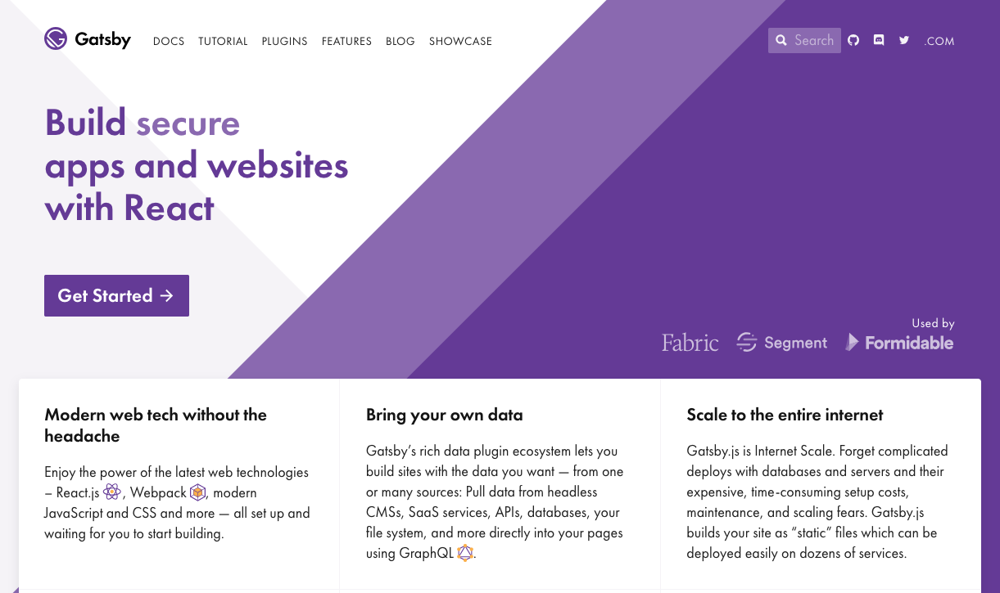


Before we do anything else, we need to install Gatsby. Gatsby is distributed via NPM - which means you should already have NodeJS and NPM installed before beginning this tutorial. If you don't currently have those installed you can [find installation steps on the NodeJS website.](https://nodejs.org/en/)

Once we have Node and NPM installed, we can execute the following command in our terminal to install Gatsby:

    npm install -g gatsby-cli

This will install Gatsby's CLI tool globally, allowing us to execute Gatsby-specific commands to generate a new project, start a development server, or build our site into a static folder for deployment. Let's start by generating a new project:

    gatsby new drupal-8-gatsby && cd drupal-8-gatsby

Next, we can start up a development server that will run on localhost:8000:

    gatsby develop

If you visit [http://localhost:8000](http://localhost:8000) you will see the default Gatsby starter application!

### 2\. Anatomy of a Gatsby Site

Before we can get to work customizing our scaffolded Gatsby site, we should probably take a look at some of the files generated when our site was built.

**One quick note:** If you aren't yet familiar with React, that's OK – we'll cover a very brief crash course here to get you started. However, a working knowledge of React is going to be very helpful in following along.

### React - the shortest tutorial ever:

At its core, you can think of React as a javascript library that allows us to **create custom HTML tags**. These custom HTML tags that we're creating are called **components**. If the HTML tag `` were a React component, we would say that it has several **props** – src, height, and width on an image tag can all be thought of as props. When we use our component in another component we can pass data into these props, and in our fictional `img.js` file (where we create and export our component) can have some internal logic that handles our props, and uses a templating language called **JSX** to return markup that eventually gets rendered in our browser.

Please note that the above crash course to React is nowhere near scratching the surface of React - this is just an attempt to get a common lexicon of terms for us to use for the course of this tutorial. Ideally, before you dig much deeper into Gatsby you may want to take the time to learn a little bit about how to use React. If that's the case, [Wes Bos' _React for Beginners_](https://reactforbeginners.com/) is a great video course that can help to kickstart your React development skills. That said, this tutorial doesn't require knowing React inside and out.

### The src directory:

First and most important among the directories in our Gatsby app is the `src` directory – as you may have guessed, this is where the source files for our Gatsby app live. Within `src`, there are two very important directories.

**Pages** is a directory that can contain any React component we want to be rendered at a given route. If we create a file at `src/pages/about.js`, for example, that component will be automatically responsive at the route "/about". Our starter kit application that was generated for us has three pages right out of the gate – index, page-2, and 404. You may have guessed by opening these files, but each of the **.js** files in the src directory is a [React component of a special type - a functional stateless component.](https://reactjs.org/docs/components-and-props.html)

**Components** is a directory that contains the more fragmentary pieces that we can use to compose a page – headers, footers, cards, or even things as small headings or links can be defined as components. Our application comes with a few by default - the most interesting one is going to the **layout component**. If you open any of the page components in our `/src/pages` directory, you'll see that the vast majority of them wrap all the rest of their markup in a `<Layout>` tag – this means that every child element gets rendered inside of the markup found in layout.js.

**Images** is a directory where we can define any static images that we want to be accessible to our templates. The Gatsby astronaut who renders on our front page, for example, is found in this directory.

### Gatsby-\*.js config files:

There are four config files that you can find at the root of any Gatsby (v2) project. Each is used for a different level of configuration on the Gatsby site we're building:

*   gatsby-browser.js: this is a file that allows us to implement any of [Gatsby's browser APIs.](https://www.gatsbyjs.org/docs/browser-apis/) Think of these as ways of injecting our own custom logic into Gatsby's boilerplate systems, such as routing. In that case, we could use onRouteUpdate to do something really annoying like send the client a javascript alert every time they load a new page.
*   gatsby-config.js: this file is our main configuration file for the Gatsby site. If we want to load any of Gatsby's [awesome contributed plugins](https://www.gatsbyjs.org/plugins/) we would declare them and any config options they need in this file. We can also define static details about our site that we want to render using the `<StaticQuery>` data fetcher component (more on that later). Take a look at the `siteMetadata` key in the default config file - you'll see the name that appears in the header of our new Gatsby site is defined here! If you update it, your dev server will automatically reload with the new title.
*   gatsby-node.js: [Gatsby's node APIs](https://www.gatsbyjs.org/docs/node-apis) can be implemented here to do things like run an onCreatePage() function that modifies pages created by a source plugin. This is also the most likely place where we'd run any custom code related to creating pages from our source backend (like Drupal).
*   gatsby-ssr.js: these are overrides for Gatsby's server rendering system. Since Gatsby is rendering each page on build time to output to a static HTML file, we have the opportunity to reach in and modify the behaviors happening during that server render step. One very common manipulation to make here is to use wrapRootElement() to wrap the entire application in a Redux state store. But that is a conversation for another tutorial!

### 3\. Our First Changes, `<StaticQuery>`, and Using GraphQL To Access Data

The starter kit we've just created is great and all, but it's hardly our own. Let's make a few modifications that personalize the starter application.

One of the really cool things about Gatsby is that regardless of the source of data, we query it and use it in our React components using the same query language – [GraphQL](https://graphql.org/). But what does that _really_ mean? To put it basically, even if we have two completely different types of data (JSON files on our local computer and fields from a Content Type on our Drupal website) we're going to use the same syntax and fundamental query structure. Another really cool thing about Gatsby's GraphQL integration is that _even our site configuration settings can be queried using GraphQL!_

To understand this a little better, let's take a look at how that is used in our starter kit codebase. If we open the file `"gatsby-config.js"` from the root of our Gatsby project, you'll see the following lines:
```javascript
    module.exports = {
      siteMetadata: {
        title: 'Gatsby Default Starter',
      },
      ...
      ...
    }
```

You'll notice that the title found under `siteMetadata` is the same title that appears in our header. But how did it get there?

Let's open our layout file (`src/components/layout.js`) to find out more:

```javascript
    ...lines skipped...
    import { StaticQuery, graphql } from 'gatsby'
    
    import Header from './header'
    ...lines skipped...
    const Layout = ({ children }) => (
      <StaticQuery
        query={graphql`
          query SiteTitleQuery {
            site {
              siteMetadata {
                title
              }
            }
          }
        `}
        render={data => (
          <>
            <Helmet
              title={data.site.siteMetadata.title}
              meta={[
                { name: 'description', content: 'Sample' },
                { name: 'keywords', content: 'sample, something' },
              ]}
            >
              <html lang="en" />
            </Helmet>
            <Header siteTitle={data.site.siteMetadata.title} />
             ...lines skipped...
          </>
        )}
      />
    )
    ...
    export default Layout
```

 you can see, at the beginning of our file we're importing `StaticQuery` and `graphql` from the 'gatsby' package – StaticQuery allows us to write a special GraphQL query that allows the component to access some data. The query itself should look quite familiar, as the structure is very similar to the gatsby-config.js file we just looked at. Lastly, we can see that the entire Layout component is actually one big `<StaticQuery>` component – rather than a conventional React component where we might have our own render function, we have a bunch of JSX written into the render prop of the `<StaticQuery>` component. That render prop has `data` passed as a props argument into the render function. And in both the `<Helmet>` element and `<Header>` element we are using our site title from that `data` prop.

Now that we roughly understand how to query and use data in our template, let's try to make a change to personalize our site a little!

First, let's go back to `gatsby-config.js` - let's make a small change:

```javascript
    module.exports = {
      siteMetadata: {
        title: 'Drupal + Gatsby = A JAMStack Love Story',
      },
      plugins: [
      ...lines skipped...
    }
```
Save that file, and visit your local development server at [http://localhost:8000](http://localhost:8000). Huzzah! You should see our updated title!

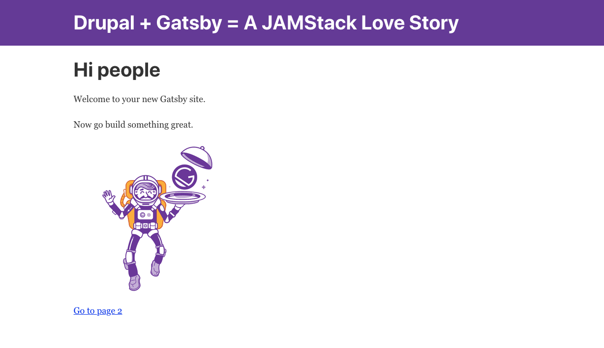

Now, following along with that query was cool and all, but you might be thinking to yourself: "How do I know what data is available? Do I just have to shoot in the dark and hope I get the right query?" Which is a really great question, and leads us to one of the really great reasons why developers love GraphQL.

Most GraphQL implementations will come with an interactive query explorer, Graph_i_QL. Gatsby is no exception! Try visiting [http://localhost:8000/\_\_\_graphql](http://localhost:8000/___graphql) in your browser, and you should be brought to a query interface. The left side of the Graph_i_QL interface is where we can write our own query – the right side is where we get a response object from the server. Let's try writing a query!

Let's take the same query that we use in our `<Layout>` component as an example. I've extracted it here for ease of use:

```graphql
    {
      site {
        siteMetadata {
          title
        }
      }
    }
    
```

Copy and paste that query into the left-hand side of Graph_i_QL, hit the "play" button at the top of the screen, and you should see our title get returned on the right.

Nice! But still, that doesn't help our problem of not knowing what data is available, right? Actually, Graph_i_QL has one more super important feature – autocomplete!

If you replace your query with an empty query object like so:
```graphql
    {
    
    }
```

and then hit `ctrl + spacebar`, you'll get a magic autocomplete dialogue that shows you all available query paths from your current level!

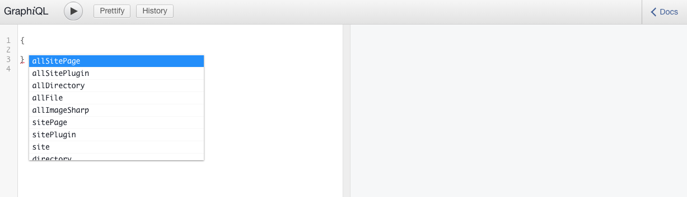

Similarly, if you just start typing, Graph_i_QL will try to autocomplete for you.

Let's try an example of how powerful this autocomplete feature can be. On our query panel, let's try the following:

```graphql
    {
      allSitePage
    }
```

Once you've pasted that into place, hit the "play" button at top of the screen. Automatically, Graph_i_QL will expand our query to include the sub-fields of all our site pages, and return a result for each one. Magic!

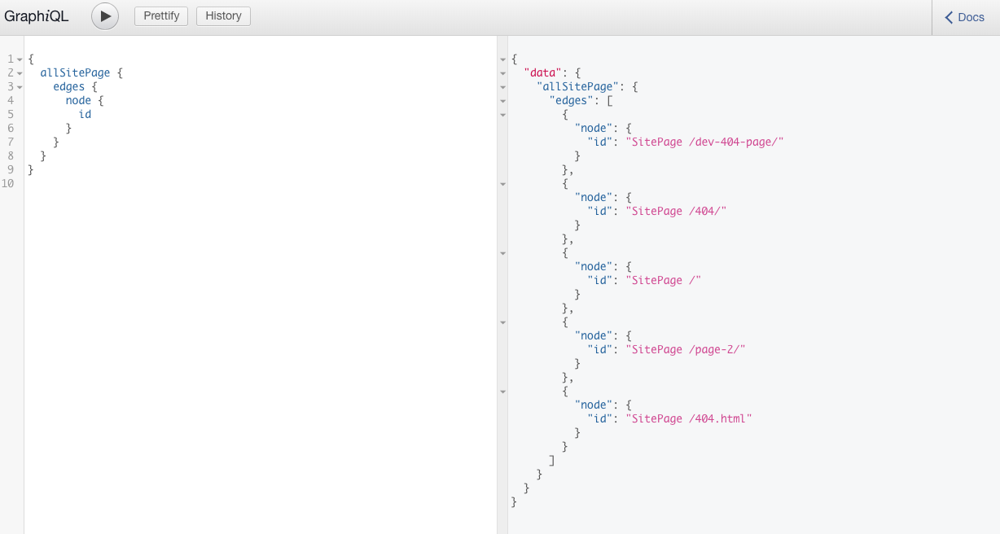

OK - so we know how to query data in our template, we know how to test out our queries in Graph_i_QL, and we know how to render our data using our React component. Let's try to add some extra data to our site config and put that knowledge to use!

Let's say we want our site not only to have a `title` in our _`siteMetadata` _element but also a `slogan`! We'll go ahead and create the new key and value on our JSON object in `gatsby-config.js`:

```javascript
    module.exports = {
      siteMetadata: {
        title: 'Drupal + Gatsby = A JAMStack Love Story',
        slogan: 'a match made in heaven',
      },
      ...lines skipped...
    }
```

Now that we've updated that data, we do need to **stop and restart our gatsby development server**. In your terminal that is running the gatsby develop command, hit **ctrl+c** to cancel, then restart the server with `gatsby develop`. After that, we can we can include our new slogan in our `<StaticQuery/>` component in `src/components/layout.js:`

```graphql
    import React from 'react'
    import PropTypes from 'prop-types'
    import Helmet from 'react-helmet'
    import { StaticQuery, graphql } from 'gatsby'
    
    import Header from './header'
    import './layout.css'
    
    const Layout = ({ children }) => (
      <StaticQuery
        query={graphql`
          query SiteTitleQuery {
            site {
              siteMetadata {
                title
                slogan
              }
            }
          }
        `}
        render={data => (
          <>
            ...lines removed...
            <Header siteTitle={data.site.siteMetadata.title} slogan={data.site.siteMetadata.slogan} />
            ...lines removed...
          </>
        )}
      />
    )
    ...lines removed...
    export default Layout
```

As you can see, we've added the `slogan` to our query, and we've also added a `slogan` prop to our `<Header>` component. That means `slogan` will be available in the **props** variable in `<Header>`.

So let's open `src/components/header.js` and actually render our slogan on the page:

```javascript
    import React from 'react'
    import { Link } from 'gatsby'
    
    const Header = ({ siteTitle, slogan }) => (
      ...lines skipped...
          <h1 style={{ margin: 0 }}>
            <Link
              to="/"
              style={{
                color: 'white',
                textDecoration: 'none',
              }}
            >
              {siteTitle}
            </Link>
          </h1>
          <span
            style={{
              color: 'white'
            }}
          >
            {slogan}
          </span>
      ...lines skipped...
    )
    
    export default Header
```

Two things are important to notice here: First, we need to pass `slogan` into our component - the object at line 4 `(const Header = ({ siteTitle, slogan }) =>)` so that it is usable in our component. Second, we render the contents of `{slogan}` using `{curlybraces}` in our JSX template. Go ahead and save that file and you should see our new header in all its glory!

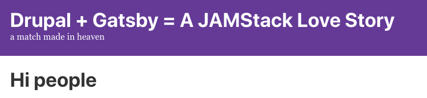

### 4\. Pulling Data from Drupal

Updating our header from the config file is exciting and all, but obviously we want to use Gatsby for some more exciting, dynamic content. After all, the whole point of this tutorial is to decouple our Drupal site!

We're going to assume that you have an existing Drupal site that uses the "Article" content type to write blog posts – if you need a good sample site to mess with just for the purposes of this tutorial, [Pantheon](https://pantheon.io/)'s free tier websites would be perfect for this. Since we're only using the site as a backend repository for our front-end, the live-your-environment.pantheonsite.io domain will serve just fine, so there's no need to set up a subdomain on your DNS, although you certainly could if you'd like to.

Setting up our Drupal site to serve data to Gatsby is relatively straightforward – the short version is that we need to enable the [JSON API](https://www.drupal.org/project/jsonapi) and [JSON API Extras](https://www.drupal.org/project/jsonapi_extras) module and then expose JSON API's endpoints publicly. If you're using Composer to manage your site's contrib modules, you can install them with the following command:

```bash
    composer require drupal/jsonapi drupal/jsonapi_extras
```

Enable both modules on your site using drush:

```bash
    drush en -y jsonapi jsonapi_extras
```

Lastly, allow anonymous users the permission to "Access JSON API resource list" at Admin > People > Permissions in your Drupal admin backend:

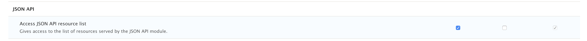

Simple as that, our Drupal site is ready to serve data to Gatsby!

Next, we'll prepare our Gatsby site to source data from Drupal. To do so, we'll use the **[gatsby-source-drupal](https://www.gatsbyjs.org/packages/gatsby-source-drupal/)** plugin – it can be installed from the root of our Gatsby project with NPM:

```bash
    npm install --save gatsby-source-drupal
```

Next, we'll include some configuration in our **gatsby-config.js** file to ensure that Gatsby knows where to fetch our Drupal data from:

```javascript
    plugins: [
      ...lines skipped...
      {
        resolve: 'gatsby-source-drupal',
        options: {
          baseUrl: 'http://yourdomain.yoursite.com/',
          apiBase: 'jsonapi', // this may be different if you're using an API-first distribution like Contenta.
        },
      }
      ...lines skipped...
    ],
```

Once the configuration has been saved, restart your dev server ("ctrl + c" and then "gatsby develop" your site is still loading at [http://localhost:8000](http://localhost:8000). In the event that your site isn't loading, there are two common error codes you may see:

*   Error code 406: you've forgotten to set the "Access JSON API resource list" permission in Drupal
*   Error code 405: you probably didn't install the jsonapi\_extras module.

Once we have our development server up and running with our Drupal data, let's go ahead and query it! If we return to our Graph_i_QL query explorer ([http://localhost:8000/\_\_\_graphql](http://localhost:8000/___graphql)), we can see that we have a ton of new top-level query autocompletions to choose from: allNodeArticle, allNodePage, etc.  Try running a query on allNodeArticle:

```graphql
    {
    	allNodeArticle
    }
```

hit the "play" button at the top of the page, and you should automatically see the query expand to show all the available sub-fields. Using autocomplete, we might expand our query out a bit to include some more data, such as node ID, title, and body:

```graphql
    {
      allNodeArticle {
        edges {
          node {
            id
            title
            body {
              value
              format
              processed
              summary
            }
          }
        }
      }
    }
```

### 5\. Creating a "dumb" Blog Component

It should be relatively clear now how powerful the GraphQL query capabilities of Gatsby are – we have full-fledged access into nodes, taxonomy terms, files, images, etc. So how can we use this content to build a Gatsby page? Let's try by building a "blog" page that renders all of our "article" content type entries with their title and a snippet of their content.

The first thing we'll need to do is create a new page in Gatsby. Pages, you'll remember, are just Gatsby components that live in the `src/pages` directory – the name of the file (in this case `blog.js`) is used to generate a route to the file (localhost:8000/blog, in this case) automatically.

Let's start by creating a new file at `src/pages/blog.js` with the following contents:

```javascript
    import React from 'react'
    
    import Layout from '../components/layout'
    
    const BlogPage = () => (
      <Layout>
        <h1>Blog</h1>
        <p>This is where our blog will live</p>
      </Layout>
    )
    
    export default BlogPage
```

This is a very simple React component that doesn't draw on any Drupal data (yet), but gives us the shell of a page that we can build on.

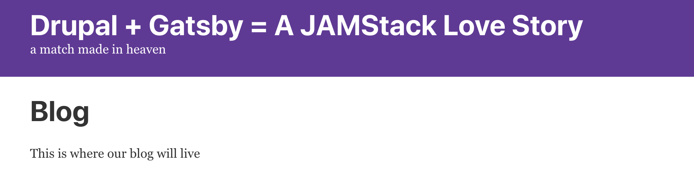

Next, since we're using React and it's nice to define things are re-usable components as much as possible, let's make a `BlogTeaser `component in our `src/components` directory:

```javascript
    import React from 'react'
    
    const BlogTeaser = ( {title, summary} ) => (
      <div className="blog--teaser">
        <h2>{title}</h2>
        <p>{summary}</p>
      </div>
    )
    
    export default BlogTeaser
```

Here we can see that we've created the component with the expectation that it will receive two props: `title` and `summary`. Let's try it out by importing it in our `blog.js` page template:

```javascript
    import React from 'react'
    
    import Layout from '../components/layout'
    import BlogTeaser from '../components/BlogTeaser.js'
    
    const BlogPage = () => (
      <Layout>
        <h1>Blog</h1>
        <BlogTeaser
          title='My first great blog post'
          summary="I have so many great thoughts, I can't help but share them!"
        />
      </Layout>
    )
    
    export default BlogPage
```

Great! You should see your first dumb (that is, non-Drupal driven) blog teaser.

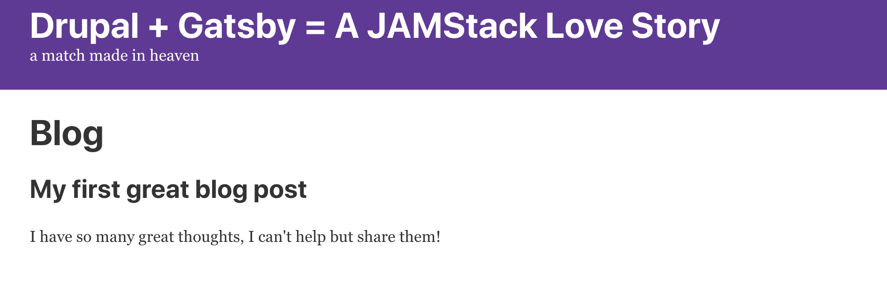

Whenever we're building out a new piece of functionality it can be a great idea to do a **dumb component** first, that way we make sure the component works correctly before we introduce the additional complexity of querying data from a remote source. So now that we know our component works, let's make it a whole lot smarter by wiring it up to our GraphQL query!

### 6\. Wiring Up Our "Smart" Blog Component 

Back in our `blog.js` component (`src/pages/blog.js`) we need to use a GraphQL query to pass data into our component. We did this earlier when we were pulling data from our config file using `<StaticQuery>`, but this time we're going to do it using a **page query** - these types of queries can only be used on a **page** component type (components found in our **pages directory**), but they also have some extra capabilities over a `<StaticQuery>`. Page queries are the only type of query that can accept variables, for example. For more info, you can check out [the Gatsby docs on the subject](https://www.gatsbyjs.org/docs/static-query/#how-staticquery-differs-from-page-query) to learn more. For now, let's suffice to say that page queries have a different syntax, which we'll see in the following updates to our blog page component:

```javascript
    import React from 'react'
    import { graphql } from 'gatsby'
    
    import Layout from '../components/layout'
    import BlogTeaser from '../components/BlogTeaser.js'
    
    const BlogPage = ( { data } ) => (
      <Layout>
        <h1>Blog</h1>
        <BlogTeaser
          title='My first great blog post'
          summary="I have so many great thoughts, I can't help but share them!"
        />
      </Layout>
    )
    
    export const query = graphql`
      query BlogPageQuery {
        allNodeArticle {
          edges {
            node {
              id
              title
              body {
                processed
                summary
              }
            }
          }
        }
      }
    `
    
    export default BlogPage
```

As you can see, we've only made a few modifications to our blog page component – first, we import the ` graphql ` library from Gatsby; next, we pass ` data ` into our component as a prop; and last, we export a new variable called `query`, which consists of our GraphQL query from earlier, which we know from our query explorer will return all of our nodes in the "article" content type. Once you've saved that file, your `blog` page component will have access to all of the data returned from our query in its `data` prop. We can confirm that using the [React devtools](https://github.com/facebook/react-devtools). If you haven't previously installed them, now is a great opportunity. Using the devtools we can use our normal browser inspector (right click > inspect element / cmd + alt + i) and visit the "React" tab to see a complete layout of our React virtual dom, including the real-time values of any component's props, state, etc.

If you use the inspector to select your **Blog** page title and then click the "React" tab in your devtools, you should see a component named ` <BlogPage> ` – click it and the right-side panel will show you all the props that have been passed to that component. Expand the `data` component and you should see the entire structure of our returned query object!

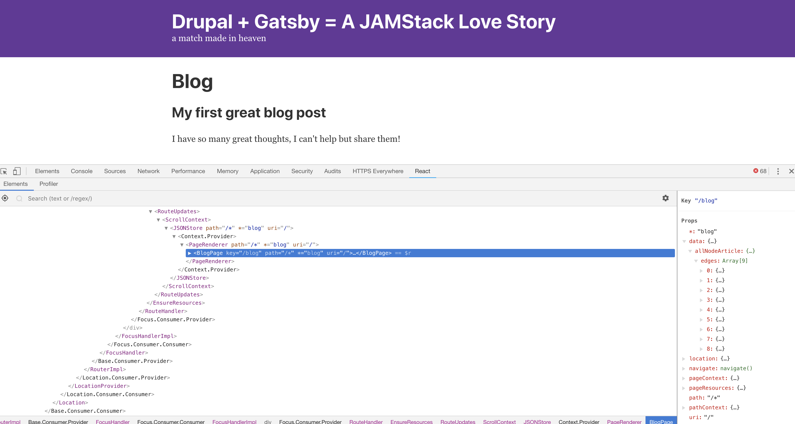

As you can see, `data.allNodeArticle.edges` is an array of each of our nodes in the **article** content type. Expanding each node from there shows that the nesting structure of our data is almost identical to our GraphQL query:

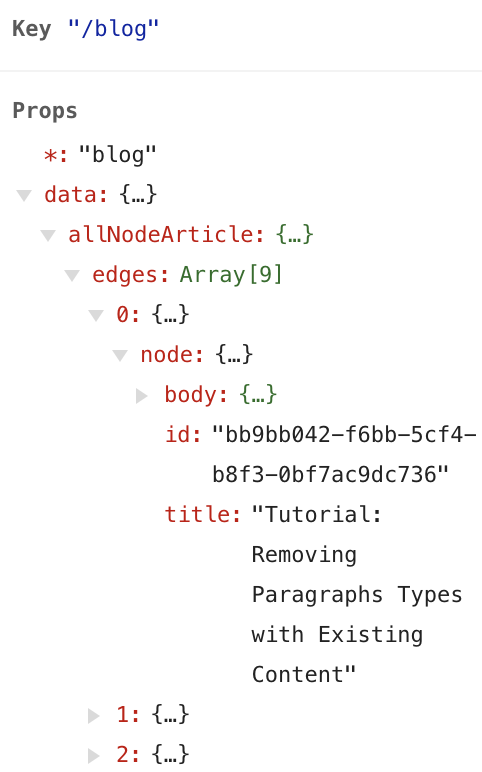

Now that we've taken a look to understand the structure of the data a little better, let's render our blog teasers! One easy and common way to render React components is using [array map](https://developer.mozilla.org/en-US/docs/Web/JavaScript/Reference/Global_Objects/Array/map) to iterate over items in an array and return a component in our JSX, as we do below:

```javascript
    ...lines skipped...
    const BlogPage = ( { data } ) => (
      <Layout>
        <h1>Blog</h1>
        {data.allNodeArticle.edges.map((post) => (
          <BlogTeaser
            key={post.node.id}
            title={post.node.title}
            summary={post.node.body.summary.length > 0 ? post.node.body.summary : post.node.body.processed.substring(0, 300)}
          />
        ) )}
      </Layout>
    )
    ...lines skipped...
```

This will take each item and output it into a `<BlogTeaser>` component - using the id as a key, mapping the title to the title, and running a [ternary operator](https://developer.mozilla.org/en-US/docs/Web/JavaScript/Reference/Operators/Conditional_Operator) on the summary length to check if it exists and either return the summary or a trimmed version of the complete body output.

One thing to note – if you see your body text appear with HTML tags rendering in the display, you'll need to pass your summary value through React's DangerouslySetInnerHTML attribute:

```javascript
    import React from 'react'
    
    const BlogTeaser = ( {title, summary} ) => (
      <div className="blog--teaser">
        <h2>{title}</h2>
        <p dangerouslySetInnerHTML={{__html: summary}} />
      </div>
    )
    
    export default BlogTeaser
```


### 7\. Dynamically Creating Pages from Drupal

Now that we have our `Blog` page component rendering a `BlogTeaser` component for every article in our Drupal site, we need to actually have a page on our site for each of those blogs to actually get served up with its total content.

To do so we'll use the following code in `gatsby-node.js.` But before we get into the code, let's talk a little bit more about Gatsby's concept of what a node is, and the two API methods we're going to implement to manipulate and act upon those nodes. If you remember back to our analysis of the Gatsby starter project codebase, you'll remember that we said `gatsby-node.js` is a place where we can use Gatsby's APIsto programmatically build pages from each article that gets pulled from Drupal. That is true, but to Gatsby, a node is a little bit more abstract than that, and it's worth explaining how and why it differs from an exact mapping to a "page" in whatever our source system is.

Let's unpack that a little bit – first of all, a Gatsby site doesn't **need** a source plugin, it can obviously just be a set of components that live in the pages directory. It's also worth noting that source plugins don't always have to be web pages. Using the plugins `gatsby-source-filesystem` and `gatsby-transformer-csv`, a "node" can just be a row of a CSV file. Said another way, **a Gatsby node is an individual record in a piece of structured, parseable data**. That data might be returned from a JSON API (like it is in our case with Drupal) or it might be items in a JSON file found locally on your machine. It could even be sourced from RSS or XML! Then, when Gatsby splits up our source content into individual nodes, it parses all the fields of that node and makes them query-able over GraphQL. It makes these nodes available in our **data layer**, and at the point that all of our nodes in our source file have been read and parsed, we can say that our **data layer has been bootstrapped**, or our data is ready to be queried, manipulated, or turned into pages.

Before we get too much further, let's take a look at some code we'll place in the `gatsby-node.js` file:

```javascript
    const path = require(`path`)
    const transliteration = require('transliteration')
    
    // Create a slug for each article and set it as a field on the node.
    exports.onCreateNode = ({ node, getNode, actions }) => {
      const { createNodeField } = actions
      if (node.internal.type === `node__article`) {
        const slugFragment = transliteration.slugify(node.title)
        const slug = `/blog/${slugFragment}/`
        createNodeField({
          node,
          name: `slug`,
          value: slug,
        })
      }
    }
    
    // Implement the Gatsby API “createPages”. This is called once the
    // data layer is bootstrapped to let plugins create pages from data.
    exports.createPages = ({ actions, graphql }) => {
      const { createPage } = actions
    
      return new Promise((resolve, reject) => {
        const postTemplate = path.resolve(`src/templates/BlogPost.js`)
        // Query for article nodes to use in creating pages.
        resolve(
          graphql(
            `
              {
                allNodeArticle {
                  edges {
                    node {
                      title
                      fields {
                        slug
                      }
                    }
                  }
                }
              }
            `
          ).then(result => {
            if (result.errors) {
              reject(result.errors)
            }
    
            // Create pages for each article.
            result.data.allNodeArticle.edges.forEach(({ node }) => {
              createPage({
                path: node.fields.slug,
                component: postTemplate,
                context: {
                  slug: node.fields.slug,
                },
              })
            })
          })
        )
      })
    }
```

Okay, that's a lot to digest all at once, so let's break it down. We really only have two big methods that we're using here. We'll tackle each one separately:

First is **[onCreateNode](https://www.gatsbyjs.org/docs/node-apis/#onCreateNode)**, which fires for every Gatsby node created. We're going to use the NPM library [Transliteration](https://www.npmjs.com/package/transliteration) to generate a "slug", or a URL-ified version of our article's title. Once we've created that we're going to **inject our new modified value as an additional field** **on our Gatsby node.** When our node has been parsed and is available as a Gatsby node, we're saying "let's add one more field that didn't exist on the source system, and I want it to be _this"._ 

Second, we're going to use [**createPages**](https://www.gatsbyjs.org/docs/node-apis/#createPages), which is a Gatsby API that gets called when our nodes have been parsed and made available (after the data layer has bootstrapped). **createPages** is called after our nodes have been processed and made available in the data layer. This method expects for you to return a Javascript Promise – if you're unfamiliar with what Promises are and how to use them in JS, [I highly recommend this short tutorial from scotch.io on the subject.](https://scotch.io/tutorials/javascript-promises-for-dummies) So, we need to return a **promise** that resolves if our GraphQL query for our Drupal data completes successfully. Then, we need to take that result and run it through **createPages**' **action** function (`createPage()`), which can be used to create a page per node in a GraphQL query. The `createPage()` action takes three arguments:

*   path – the route where we want to serve the page
*   template – a Gatsby component that we want to use to create the page
*   context – additional data which can be used as arguments on the page template's GraphQL query

One important thing to notice is that we're **not passing all of the page data to the pageCreate** **function**. The actual querying of the data happens in the template – all we are providing the template with is enough data for that individual page to be able to run **its own** GraphQL query for the single node that it needs. So we are giving the template access to the **slug** value that we created earlier, which can be used to query for that individual node in our template.

### Defining a Page Template for Programmatic Pages

Now that we have our logic defined for programmatically building pages, we need a template component to render our data to! As we saw in the last section, `createPage()` takes three arguments. **Template** is the name of a Gatsby component template that we're going to use for each page that gets built in the `createPages()` step.

Let's create a new directory, `src/templates`, and create a new file in it, called `BlogPost.js`:

```javascript
    import { graphql } from "gatsby"
    import moment from 'moment'
    import React from "react"
    
    import Layout from "../components/layout"
    
    const BlogPost = ({ data }) => (
      <Layout>
        <article>
          <h1>{data.nodeArticle.title}</h1>
          <i><p className="publication-date">{moment.unix(data.nodeArticle.created).format('DD MMMM, YYYY - h:mm A')}</p></i>
          <span dangerouslySetInnerHTML={{__html: data.nodeArticle.body.processed}}></span>
        </article>
      </Layout>
    )
    export default BlogPost
    
    export const query = graphql`
      query($slug: String!) {
        nodeArticle (fields: { slug: { eq: $slug } }) {
          title
          created
          changed
          body {
            processed
            summary
          }
        }
      }
    `
```

The first thing we'll notice is that we're using a library here, [Moment.js](https://momentjs.com/) to do some timestamp parsing, so we'll need to install that with NPM:

```bash
    npm install --save moment
```

Now, let's take a look at our template. First, we use the `<Layout>` component to wrap everything in our default page layout with our header, etc. Then, we use our article title, data, and body in a few HTML tags to render the output into an HTML5 `<article>` tag. Note that we're using `dangerouslySetInnerHTML` to set the contents of our `<span>` tag to the entire processed body field from our Drupal article.

Moving on to our query, the first thing you'll notice is that the syntax is slightly different than our other page queries thus far. Particularly, we have a `query($slug: String!)` at the beginning – this is a GraphQL query variable. The notation basically says "expect a variable we're calling `$slug`, and expect it to be a string. You'll remember that in `gatsby-node.js` in the `createPage()` function we passed an argument for `context` that had a key/value pair that defined the key `slug` to our URL slug. Next, we have another new style of line in our GraphQL query: `nodeArticle (fields: { slug: { eq: $slug } })`. What this says is that we'll query the Gatsby nodes created in our data layer from our Drupal site of the type Article where the field `slug` is equivalent to our variable called `$slug`, which is passed in via createPage's context.

We only need to do one last thing! Now that our Drupal Articles have pages on our Gatsby site, we need a way to access them! But how? If you remember, we injected the new field `slug` into each of our nodeArticle nodes in the data layer, so if we revisit our query in our `Blog.js` page component, we can get that from our query and pass it down to our `<BlogTeaser>` components to create a link to the full view for that given blog post.

In `src/pages/blog.js`:
```javascript
    ...lines skipped...
    const BlogPage = ( { data } ) => (
      <Layout>
        <h1>Blog</h1>
        {data.allNodeArticle.edges.map((post) => (
          <BlogTeaser
            slug={post.node.slug}
            key={post.node.id}
            title={post.node.title}
            summary={post.node.body.summary.length > 0 ? post.node.body.summary : post.node.body.processed.substring(0, 300)}
          />
        ) )}
      </Layout>
    )
    
    export const query = graphql`
      query BlogPageQuery {
        allNodeArticle {
          edges {
            node {
              fields {
                slug
              }
              id
              title
              body {
                processed
                summary
              }
            }
          }
        }
      }
    `
    ...lines skipped...
```

As you can see, we've added `slug` to our GraphQL query, and we're passing it down to `<BlogTeaser>` with the slug prop.

`src/components/BlogTeaser.js`:

```javascript
    import React from 'react'
    import { Link } from 'gatsby'
    
    const BlogTeaser = ( {slug, title, summary} ) => (
      <div className="blog--teaser">
        <Link to={slug}>
          <h2>{title}</h2>
        </Link>
        <p dangerouslySetInnerHTML={{__html: summary}} />
      </div>
    )
    
    export default BlogTeaser
```

Now, in our `BlogTeaser` component we're using a Gatsby-provided component, `Link`, to link to our newly-built page by the slug. Using `<Link>` has the added benefit that it will use Gatsby's built-in prefetching functionality, making your site blazing fast after the initial page load.

It's been a while, but let's go and take a look at our development site at [http://localhost:8000/blog](http://localhost:8000/blog). We should see our blog teasers with the titles linked to individual blog post pages! Click through to one and we can see how quick the page transition is, it's really amazing.

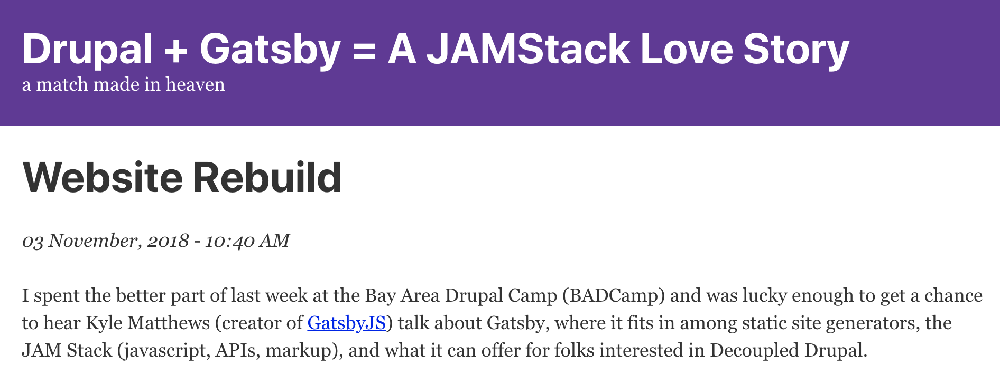

**Note:** if you didn't follow along step-by-step or are having problems debugging your application, you can visit my [Github repo](https://github.com/porkloin/drupal-8-gatsby) to clone a working copy of the project up to this point to play with.

### Conclusion

Hopefully this tutorial has been helpful for learning the basic building blocks of a Drupal-powered Gatsby application. We've covered a lot in this tutorial, and although much of it was toward a rather humble goal (after all, we could do all of this in Drupal without a single line of code), some of the real benefits of Gatsby become very apparent as you realize how performant and flexible Gatsby is. While Drupal provides an amazing amount of power with very little coding and configuration required, overriding the default behaviors of Drupal can be incredibly aggravating. While Twig has alleviated the majority of my issues in dealing with Drupal's templating system, if I'm given a choice between a Drupal render array and Gatsby's amazing GraphQL query system, I'll take Gatsby 9 out of 10 times. However, it's also important to note that Gatsby comes with some relatively major limitations, including lack of out-of-the-box support for authentication, form submissions, or other user-submitted data.

Lastly, this is just the first tutorial in what I hope will become a series of tutorials on how to leverage Gatsby to build faster and more compelling web sites and applications. Expect future entries to cover Gatsby's support for "blur up" progressive image loading, importing complex content from Drupal, and more! Stay tuned!